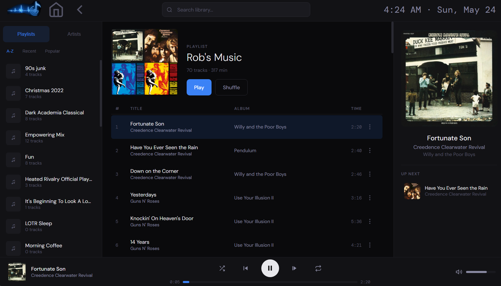
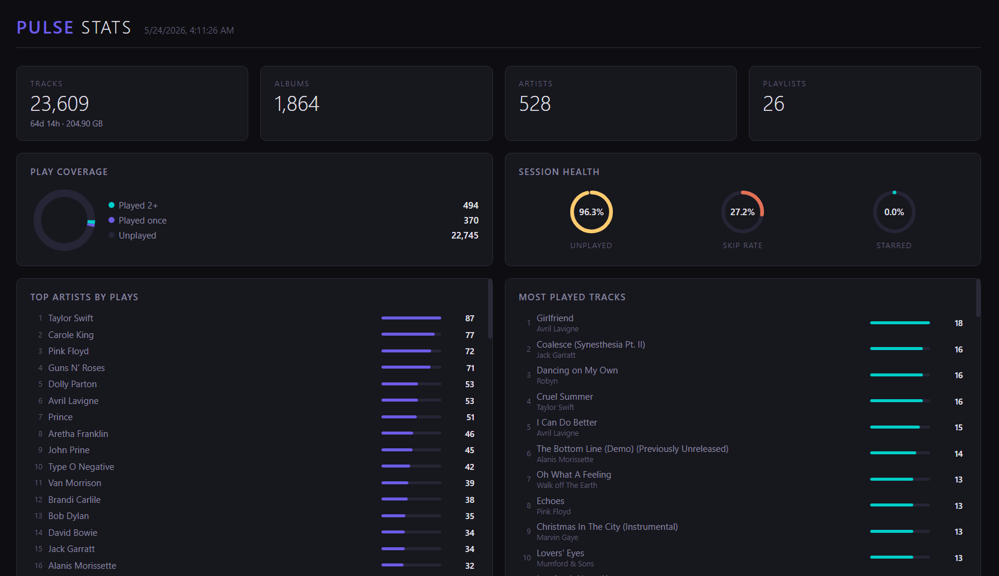
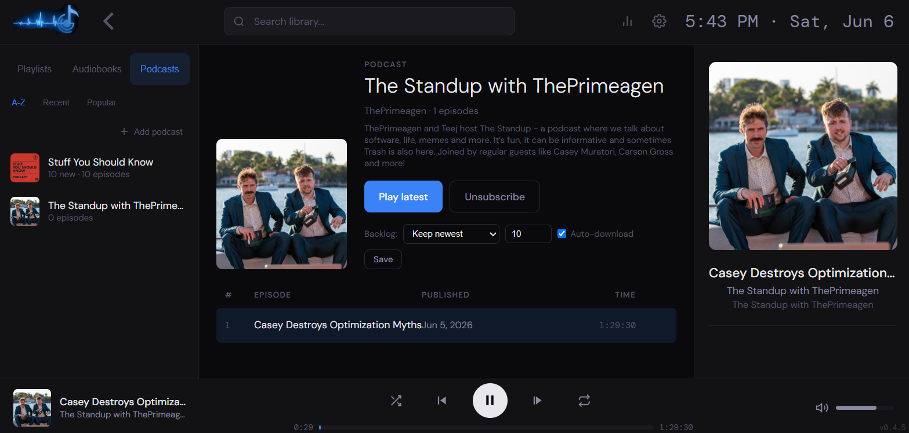
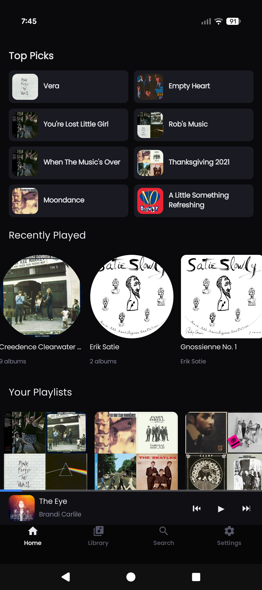
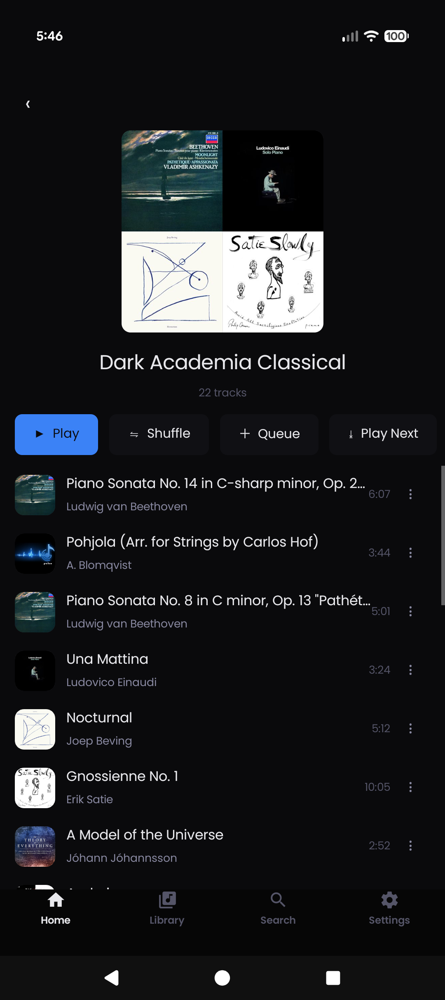
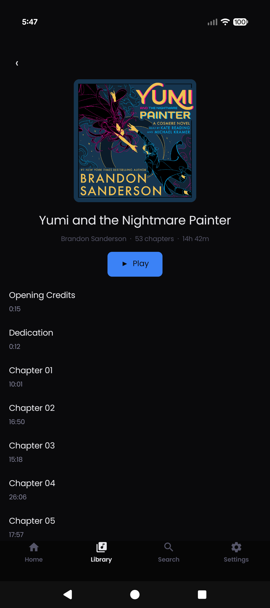
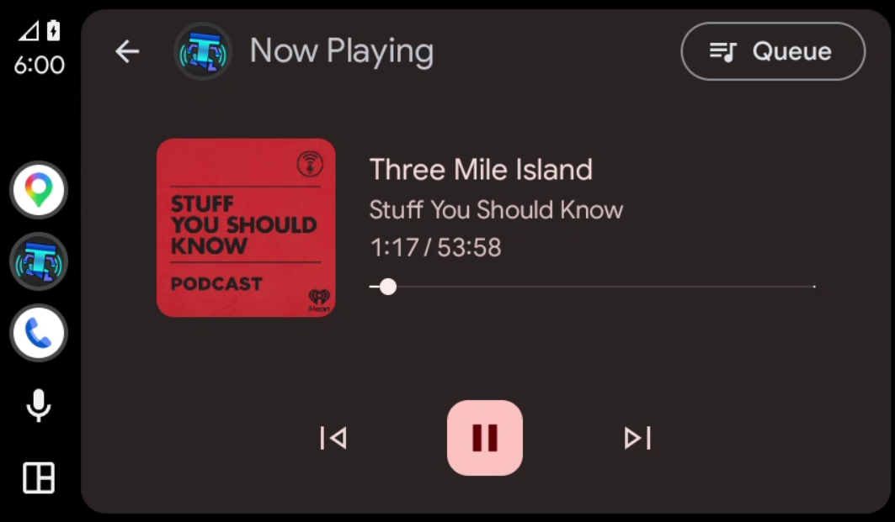
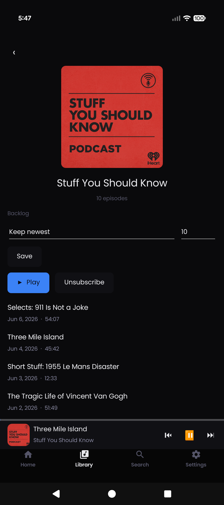
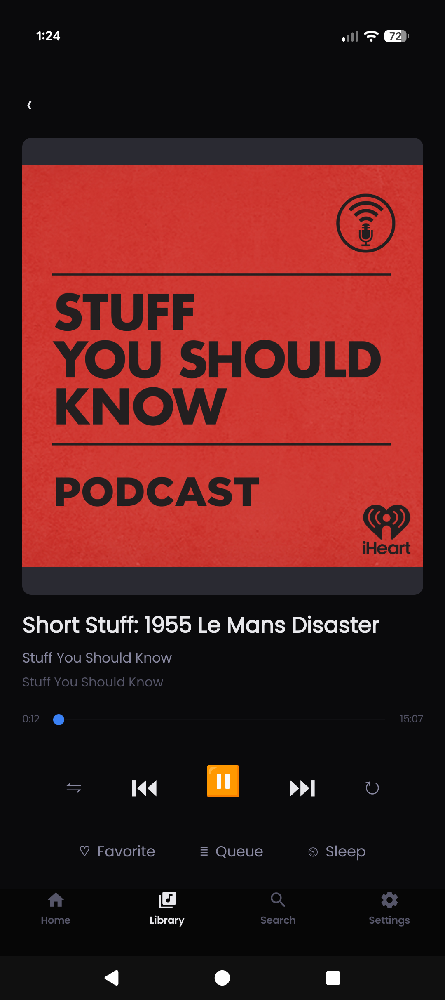

  

# Pulse

Pulse is a self-hosted music ecosystem — a single app that serves your library through a webpage or an android client with android auto support.

One executable, no external services, no database server. It scans your library, serves it over its own API, and gets out of the way.

## What you get

**Music, podcasts, and audiobooks** in one place. Subscribe to podcast feeds with auto-download and backlog management. Import audiobooks and pick up where you left off across devices.

**Smart playlists** that learn what you actually listen to. Bayesian scoring weighted by listen ratio, skip rate, and play history — not what an algorithm thinks you should hear.

**Library stats** that tell you what's really going on — play coverage, session health, top artists, most played tracks, all at a glance.

  

## Pulse — the server

A single C# executable. Scans your library, serves the Pulse API, hosts a tablet-optimized web player.

See [Pulse/README.md](Pulse/README.md) for configuration and build instructions.

  

## Thump — the Android client

A native Android app built with .NET MAUI. Streams from your Pulse server, caches tracks for offline playback, and works with Android Auto. Music, podcasts, and audiobooks.

  
  
  

  

  
  

See [Thump/README.md](Thump/README.md) for build instructions.

## License

MIT — see [LICENSE](LICENSE).