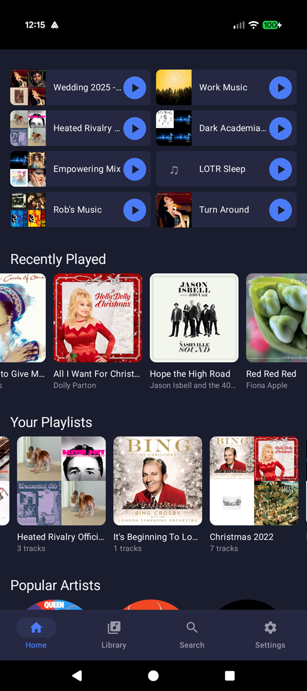
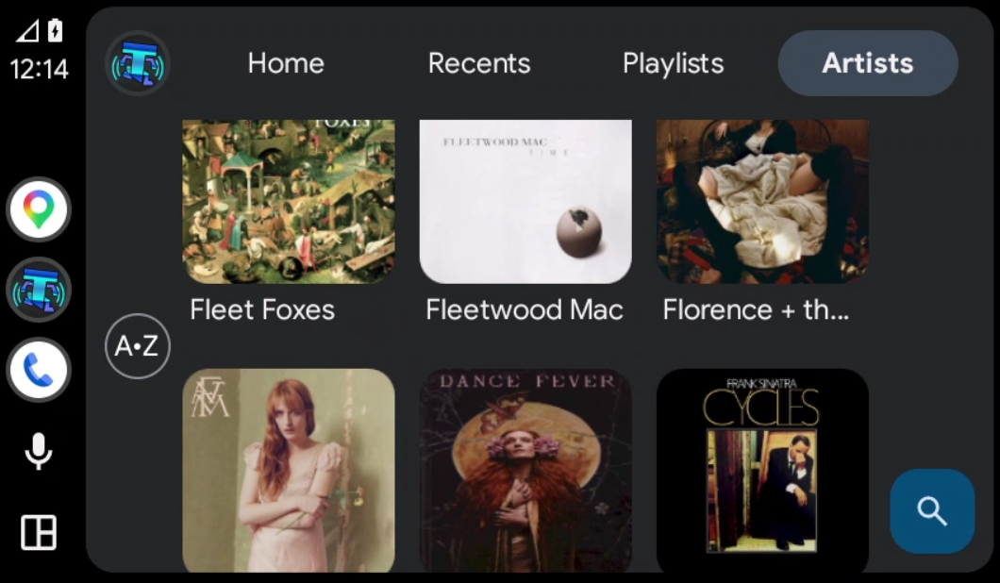

# Thump

Music player for Android, built to pair with a Pulse server.

Pulse server available here
https://github.com/therobm/Pulse

See `Docs/spec.md` for the full specification.

## Screenshots

| Phone home | Android Auto |
| --- | --- |
|  |  |

## Build

Requires the .NET 10 SDK with the `maui-android` workload (`dotnet workload install maui-android`) and the Android SDK (minSdk 23).

```
dotnet build -f net10.0-android
```

## License

MIT — see `LICENSE`.
